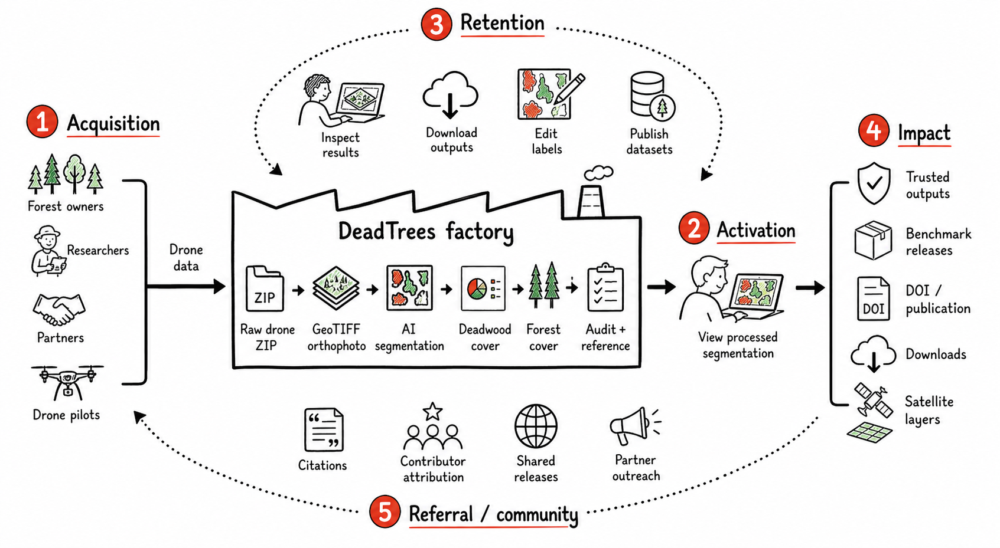
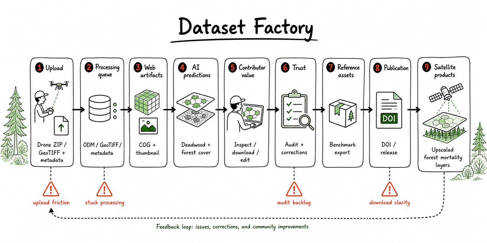

# DeadTrees Customer Factory Product Map

This document defines the user-facing product model for DeadTrees. It should be
the shared basis for product decisions, analytics, and regression tests.

DeadTrees exists to collect high-quality forest drone imagery, process it into
deadwood and forest-cover segmentation, turn the best outputs into trusted
reference/benchmark data, and use that data for satellite-scale forest mortality
products.

## Framework

Use Ash Maurya's Customer Factory as the operating model:

- **Input**: potential contributors, data users, reviewers, and partners.
- **Output**: people who achieve a concrete outcome through DeadTrees.
- **Throughput**: the weekly rate at which these outcomes happen.
- **Constraint**: the weakest step in the system right now.

The useful question is not "which features exist?" but:

> Where does the DeadTrees factory currently lose valuable data, trust, reuse,
> or contributor momentum?

Sources:

- [The Customer Factory](https://www.leanfoundry.com/articles/customer-factory)
- [How to Systematically Prioritize and Tackle the Riskiest Assumptions in Your Business Model](https://www.leanfoundry.com/articles/how-to-systematically-prioritize-and-tackle-the-riskiest-assumptions-in-your-business-model)
- [Traction is the Goal. Everything Else is Distraction.](https://www.leanfoundry.com/articles/traction-is-the-goal-everything-else-is-distraction)
- [What's Your Company's Bottleneck?](https://www.lean.org/the-lean-post/articles/whats-your-companys-bottleneck/)

## Product Roles

### Priority Role: Data Contributor

The priority customer for the current phase is the data contributor: someone
with access to forests who can upload raw drone imagery or pre-processed
GeoTIFF orthophotos.

Their expected value:

- AI-derived deadwood, standing deadwood, and forest-cover segmentation.
- A processed dataset they can inspect, download, reuse, and cite.
- A path to improve labels/corrections.
- Attribution and optional publication through DOI/FreiDATA.

This role matters most because new high-quality drone data is the scarce input
for reference datasets, benchmark datasets, model improvement, and satellite
upscaling.

### Other Important Roles

- **Reference / benchmark data reuser**: mainly ML users who need drone-derived
  reference datasets, benchmark data, model outputs, and releases.
- **Satellite data user**: mainly ecological or applied researchers who need
  large-scale satellite-derived layers for analysis.
- **Core team / expert reviewer**: audits datasets, resolves flags and edits,
  maintains trusted reference data, and keeps the factory running.
- **General explorer**: browses the site, archive, maps, or releases without yet
  contributing or downloading.

## North Star

Candidate north-star metric:

> Weekly trusted forest-data outcomes.

This is not one raw count. It should be reported as a small metric stack:

| Layer | Measures | Why it matters |
| --- | --- | --- |
| Input | New qualified drone ZIP and GeoTIFF submissions; unique contributors; countries, regions, biomes, acquisition periods. | Shows whether the platform is growing the raw data base. |
| Processing | Successful processing rate; processing lead time; failure rate; time-to-notify; time-to-fix. | Shows whether submissions become usable outputs fast enough. |
| Trust | Audited datasets; corrected labels; validated reference patches; release-ready benchmark assets. | Shows whether outputs are reliable enough for reuse and model training. |
| Impact | Downloads; release artifact access; publications/DOIs; repeat users; future satellite dataset downloads. | Shows whether the created data is actually used. |

Contributor processing target: results should ideally be available within one
hour, with two hours as the upper bound for a healthy experience.

## Factory Steps

| Step | Product meaning | Primary actions | Existing events |
| --- | --- | --- | --- |
| Acquisition | A potential contributor or user discovers that DeadTrees is relevant. | Visit homepage, browse archive, open releases, search/filter map, sign up/contact. | `$pageview`, `landing_cta_clicked`, `faq_opened`, `newsletter_signup_submitted`, `dataset_archive_viewed`, `dataset_search_used`, `dataset_filter_applied`, `dataset_map_interacted`. |
| Activation | First clear value moment. | Contributor has processing completed and then views the processed segmentation result for the first time. Data-reuser activation is less clear and should be validated with analytics before prioritizing. | `dataset_opened`, `processing_result_viewed`, `sign_up_started`, `sign_up_completed`, `sign_in_completed`, `upload_started`, `upload_completed`. |
| Retention / value | User comes back to do work. | Download, edit, save corrections, report issue, inspect own datasets, audit, review corrections, use reference editor. | `dataset_download_started`, `dataset_download_completed`, `edit_started`, `edit_saved`, `flag_submitted`, `audit_queue_viewed`, `audit_started`, `audit_completed`, `correction_review_started`, `correction_approved`, `correction_reverted`, `reference_patch_editor_opened`. |
| Impact capture | The platform creates durable scientific value. | Publish datasets, validate reference patches, create releases, generate satellite inputs/outputs, cite or reuse data. | `publish_started`, `publish_submitted`, `publish_completed`, `publish_failed`, `dataset_download_completed`, `audit_completed`, `correction_approved`. |
| Referral / community | Existing value brings in new contributors or users. | Contributor attribution, DOI/citation, shared releases, partner outreach, newsletter/contact. | `newsletter_signup_submitted`, `email_link_clicked` is planned in the current event map. |

## Core User Actions

### Contributor Actions

- Open upload path from homepage, archive, or profile.
- Sign up or sign in.
- Select raw drone ZIP or GeoTIFF orthophoto.
- Add required metadata: platform, license, spectral properties, acquisition
  date, authors, DOI/reference, access mode, optional labels.
- Upload through chunked upload.
- Queue processing:
  `odm_processing` for raw images, then `geotiff`, `cog`, `thumbnail`,
  `metadata`, `deadwood_v1`, `treecover_v1`,
  `deadwood_treecover_combined_v2`.
- View processing status.
- Open processed result and inspect orthophoto, deadwood, standing deadwood,
  forest cover, metadata, and quality state.
- Download outputs.
- Improve predictions through correction/labeling tools.
- Publish eligible datasets with authors/ORCID metadata.

### Data Reuse Actions

- Find data through archive, map, search, filters, or releases.
- Inspect provenance, DOI/reference, author, location, biome, acquisition date,
  audit state, and model citations.
- View orthophoto and prediction layers.
- Download full dataset, labels-only GeoPackage, or release artifact.
- Report an orthomosaic or prediction issue.
- Use benchmark/reference releases for ML workflows.
- Use satellite layers or future satellite downloads for ecological analysis.

### Core Team Actions

- Review audit queues by status, biome, country, contributor, auditor, flags,
  acquisition period, season, processing stage, and user.
- Audit georeferencing, acquisition date, phenology, COG, thumbnail, AOI,
  prediction quality, and final assessment.
- Resolve user flags and submitted corrections.
- Place and validate reference patches.
- Monitor processing queues, stuck stages, failures, and logs.

## Dataset Factory

The user factory depends on dataset throughput:

Flow: upload intent -> drone ZIP or GeoTIFF + metadata -> processing queue ->
ODM/GeoTIFF/metadata -> COG + thumbnail -> AI predictions -> contributor
inspection/download/editing -> audit/corrections -> reference or benchmark
export -> release/publication -> satellite products.

Likely bottleneck areas:

- Upload intent lost before upload starts.
- Uploads fail or take too long.
- Processing fails, gets stuck, or leaves users uninformed.
- Contributors cannot easily inspect, reuse, edit, or publish processed results.
- Audit/correction/reference review backlog delays trust.
- Downloads/releases are unclear or slow.
- Satellite data exists as a map but not yet as a clear downloadable product.

## Analytics Gaps

Keep the current AARRR event names in
[`docs/analytics/aarrr-framework.md`](aarrr-framework.md). Add events only when
they diagnose a bottleneck or anchor a regression test.

Highest-value missing events:

| Event | Purpose |
| --- | --- |
| `upload_modal_opened` | Measures upload intent before upload start. |
| `upload_validation_failed` | Finds blockers in file type, size, metadata, or GeoTIFF/ZIP validation. |
| `processing_queued` | Confirms upload became backend work. |
| `processing_completed` | Measures conversion from submission to usable output. |
| `processing_failed` | Measures product-level failure rate. |
| `processing_failure_notified` | Measures whether failed contributors are kept informed. |
| `processing_failure_resolved` | Measures time-to-fix. |
| `owner_processing_result_viewed` | Measures contributor activation after processing. |
| `dataset_layer_toggled` | Shows whether users inspect orthophoto, deadwood, forest cover, AOI, or metadata only. |
| `download_restricted` | Measures view-only/private access friction. |
| `label_improvement_started` / `label_improvement_saved` | Measures edited and improved datasets. |
| `audit_saved_and_next` | Measures reviewer throughput. |
| `flag_status_updated` | Measures closing the loop on user-reported issues. |
| `reference_patch_validated` | Measures trusted reference-data creation. |
| `release_opened` / `release_artifact_clicked` | Measures benchmark/reference reuse. |
| `satellite_map_opened` / `satellite_layer_toggled` | Separates satellite-data users from drone/reference users. |
| `satellite_dataset_downloaded` | Future event once satellite downloads exist. |

## Test Backbone

Each base product action should have at least one durable test or smoke check.

| Area | Minimum coverage |
| --- | --- |
| Discovery | Homepage, dataset archive, search/filter/map, release index. |
| Contribution | Auth routes, upload modal validation, raw ZIP vs GeoTIFF handling, processing queue request. |
| Processing visibility | Profile processing status, failed/stuck states, user-facing notification path. |
| Result inspection | Dataset details, COG map, layer controls, metadata, audit state, satellite map. |
| Reuse | Download preparing/completed/failed states, labels-only download, view-only restrictions, release artifact links. |
| Improvement | Issue reporting, correction editor start/save, correction approval/revert. |
| Trust | Audit queue filters, audit lock, audit save, reference patch validation/export readiness. |
| Publication | Dataset selection, author/ORCID validation, publication submission state. |

## Current Decisions

1. **Weekly headline metric**: use a composite, not a single count. The current
   scorecard should include qualified submissions, successful processing,
   processing lead time, failures/time-to-fix, audited or trusted assets,
   downloads, publications, validated reference patches, and release usage.
2. **Healthy processing lead time**: target one hour from completed upload to
   processed result. Two hours is the upper bound for a healthy contributor
   experience.
3. **Contributor activation**: processing is completed and the contributor
   views the processed segmentation result for the first time.
4. **Data-reuser activation**: unresolved. At this stage, contributor outcomes
   are more important. Downloads and release usage should still be measured,
   but analytics should separate contributor downloads from non-contributor
   reuse before treating data reuse as a primary activation metric.
5. **Satellite-user activation**: acceptable for now as satellite map/layer
   usage. This should be revisited once satellite data becomes a clearer
   downloadable product.
6. **Audits**: internal operating process for now. Audit state may be visible to
   users, but audits are not yet the main user-facing product promise.
7. **Private and view-only datasets**: count as successful contributions when
   they provide usable model-training/reference value. They should not be
   discounted just because public reuse is restricted.
8. **Referral loop**: unresolved. Contributor attribution, DOI/citation,
   releases, partner outreach, and newsletter/contact are candidates, but the
   actual loop is not yet clear.
