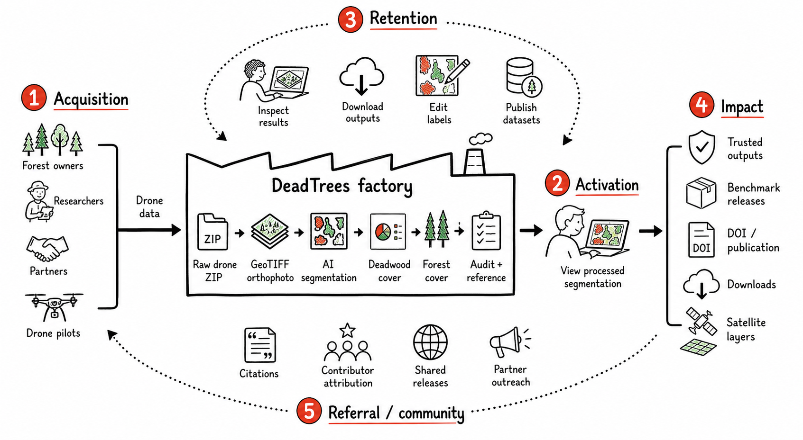
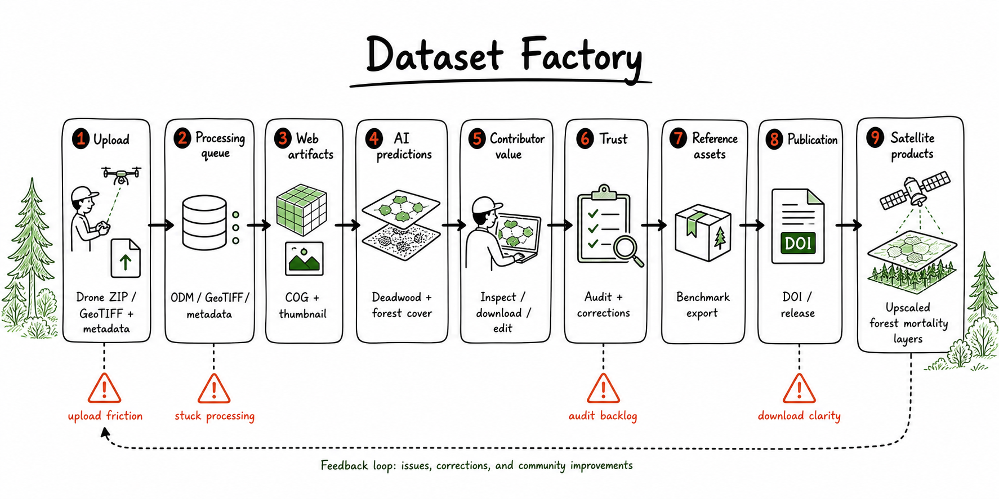

# DeadTrees Data Factory

This document defines the user-facing product model for DeadTrees. It should be
the shared basis for product decisions, analytics, and regression tests.

DeadTrees exists to collect high-quality forest drone imagery, process it into
deadwood and forest-cover segmentation, turn the best outputs into trusted
reference/benchmark data, and use that data for satellite-scale forest mortality
products.

## Framework

Use the DeadTrees Data Factory as the operating model:

- **Input**: potential contributors, data users, reviewers, partners, and raw
  forest data.
- **Output**: processed, trusted, reusable forest data products and the people
  who can act on them.
- **Throughput**: the weekly rate at which these outcomes happen.
- **Constraint**: the weakest step in the system right now.

The useful question is not "which features exist?" but:

> Where does the DeadTrees factory currently lose valuable data, trust, reuse,
> or contributor momentum?

Background sources:

- [How to Systematically Prioritize and Tackle the Riskiest Assumptions in Your Business Model](https://www.leanfoundry.com/articles/how-to-systematically-prioritize-and-tackle-the-riskiest-assumptions-in-your-business-model)
- [Traction is the Goal. Everything Else is Distraction.](https://www.leanfoundry.com/articles/traction-is-the-goal-everything-else-is-distraction)
- [What's Your Company's Bottleneck?](https://www.lean.org/the-lean-post/articles/whats-your-companys-bottleneck/)

## Product Roles

### Priority Role: Data Contributor

The priority role for the current phase is the data contributor: someone with
access to forests who can upload raw drone imagery or pre-processed GeoTIFF
orthophotos.

Their expected value:

- AI-derived deadwood, standing deadwood, and forest-cover segmentation.
- A processed dataset they can inspect, download, reuse, and cite.
- A path to improve labels/corrections.
- Attribution and optional publication through DOI/FreiDATA.

This role matters most because new high-quality drone data is the scarce input
for reference datasets, benchmark datasets, model improvement, and satellite
upscaling.

### Other Important Roles

- **Reference / benchmark data reuser**: mainly ML users who need drone-derived
  reference datasets, benchmark data, model outputs, and releases.
- **Satellite data user**: mainly ecological or applied researchers who need
  large-scale satellite-derived layers for analysis.
- **Core team / expert reviewer**: audits datasets, resolves flags and edits,
  maintains trusted reference data, and keeps the factory running.
- **General explorer**: browses the site, archive, maps, or releases without yet
  contributing or downloading.

## North Star

Candidate north-star metric:

> Weekly trusted forest-data outcomes.

This is not one raw count. It should be reported as a small metric stack:

| Layer | Measures | Why it matters |
| --- | --- | --- |
| Input | New qualified drone ZIP and GeoTIFF submissions; unique contributors; countries, regions, biomes, acquisition periods. | Shows whether the platform is growing the raw data base. |
| Processing | Successful processing rate; processing lead time; failure rate; time-to-notify; time-to-fix. | Shows whether submissions become usable outputs fast enough. |
| Trust | Audited datasets; corrected labels; validated reference patches; release-ready benchmark assets. | Shows whether outputs are reliable enough for reuse and model training. |
| Impact | Downloads; release artifact access; publications/DOIs; repeat users; future satellite dataset downloads. | Shows whether the created data is actually used. |

Contributor processing target: results should ideally be available within one
hour, with two hours as an initial healthy-experience reference for typical
GeoTIFF submissions. Workflow and input size matter; raw-image photogrammetry
and larger inputs need separately calibrated expectations. These are soft
operational warnings, never cancellation deadlines.

## Factory Steps

| Step | Product meaning | Primary actions | Existing events |
| --- | --- | --- | --- |
| Acquisition | A potential contributor or user discovers that DeadTrees is relevant. | Visit homepage, browse archive, open releases, search/filter map, sign up/contact. | `$pageview`, `landing_cta_clicked`, `faq_opened`, `newsletter_signup_submitted`, `dataset_archive_viewed`, `dataset_search_used`, `dataset_filter_applied`, `dataset_map_interacted`. |
| Activation | First clear value moment. | Contributor has processing completed and then views the processed segmentation result for the first time. Data-reuser activation is less clear and should be validated with analytics before prioritizing. | `dataset_opened`, `processing_result_viewed`, `sign_up_started`, `sign_up_completed`, `sign_in_completed`, `upload_started`, `upload_completed`. |
| Retention / value | User comes back to do work. | Download, edit, save corrections, report issue, inspect own datasets, audit, review corrections, use reference editor. | `dataset_download_started`, `dataset_download_completed`, `edit_started`, `edit_saved`, `flag_submitted`, `audit_queue_viewed`, `audit_started`, `audit_completed`, `correction_review_started`, `correction_approved`, `correction_reverted`, `reference_patch_editor_opened`. |
| Impact capture | The platform creates durable scientific value. | Publish datasets, validate reference patches, create releases, generate satellite inputs/outputs, cite or reuse data. | `publish_started`, `publish_submitted`, `publish_completed`, `publish_failed`, `dataset_download_completed`, `audit_completed`, `correction_approved`. |
| Referral / community | Existing value brings in new contributors or users. | Contributor attribution, DOI/citation, shared releases, partner outreach, newsletter/contact. | `newsletter_signup_submitted`, `email_link_clicked` is planned in the current event map. |

## Core User Actions

### Contributor Actions

- Open upload path from homepage, archive, or profile.
- Sign up or sign in.
- Select raw drone ZIP or GeoTIFF orthophoto.
- Add required metadata: platform, license, spectral properties, acquisition
  date, authors, DOI/reference, access mode, optional labels.
- Upload through chunked upload.
- Queue processing:
  `odm_processing` for raw images, then `geotiff`, `cog`, `thumbnail`,
  `metadata`, `deadwood_v1`, `treecover_v1`,
  `deadwood_treecover_combined_v2`.
- View processing status.
- Open processed result and inspect orthophoto, deadwood, standing deadwood,
  forest cover, metadata, and quality state.
- Download outputs.
- Improve predictions through correction/labeling tools.
- Publish eligible datasets with authors/ORCID metadata.

### Data Reuse Actions

- Find data through archive, map, search, filters, or releases.
- Inspect provenance, DOI/reference, author, location, biome, acquisition date,
  audit state, and model citations.
- View orthophoto and prediction layers.
- Download full dataset, labels-only GeoPackage, or release artifact.
- Report an orthomosaic or prediction issue.
- Use benchmark/reference releases for ML workflows.
- Use satellite layers or future satellite downloads for ecological analysis.

### Core Team Actions

- Review audit queues by status, biome, country, contributor, auditor, flags,
  acquisition period, season, processing stage, and user.
- Audit georeferencing, acquisition date, phenology, COG, thumbnail, AOI,
  prediction quality, and final assessment.
- Resolve user flags and submitted corrections.
- Place and validate reference patches.
- Monitor processing queues, stuck stages, failures, and logs.

## Dataset Factory

The data factory depends on dataset throughput:

Flow: upload intent -> drone ZIP or GeoTIFF + metadata -> processing queue ->
ODM/GeoTIFF/metadata -> COG + thumbnail -> AI predictions -> contributor
inspection/download/editing -> audit/corrections -> reference or benchmark
export -> release/publication -> satellite products.

Likely bottleneck areas:

- Upload intent lost before upload starts.
- Uploads fail or take too long.
- Processing fails, gets stuck, or leaves users uninformed.
- Contributors cannot easily inspect, reuse, edit, or publish processed results.
- Audit/correction/reference review backlog delays trust.
- Downloads/releases are unclear or slow.
- Satellite data exists as a map but not yet as a clear downloadable product.

## Analytics Gaps

Keep the current AARRR event names in
[`docs/analytics/aarrr-framework.md`](aarrr-framework.md). Add events only when
they diagnose a bottleneck or anchor a regression test.

Highest-value missing events:

| Event | Purpose |
| --- | --- |
| `upload_modal_opened` | Measures upload intent before upload start. |
| `upload_validation_failed` | Finds blockers in file type, size, metadata, or GeoTIFF/ZIP validation. |
| `processing_queued` | Confirms upload became backend work. |
| `processing_completed` | Measures conversion from submission to usable output. |
| `processing_failed` | Measures product-level failure rate. |
| `processing_failure_notified` | Measures whether failed contributors are kept informed. |
| `processing_failure_resolved` | Measures time-to-fix. |
| `owner_processing_result_viewed` | Measures contributor activation after processing. |
| `dataset_layer_toggled` | Shows whether users inspect orthophoto, deadwood, forest cover, AOI, or metadata only. |
| `download_restricted` | Measures view-only/private access friction. |
| `label_improvement_started` / `label_improvement_saved` | Measures edited and improved datasets. |
| `audit_saved_and_next` | Measures reviewer throughput. |
| `flag_status_updated` | Measures closing the loop on user-reported issues. |
| `reference_patch_validated` | Measures trusted reference-data creation. |
| `release_opened` / `release_artifact_clicked` | Measures benchmark/reference reuse. |
| `satellite_map_opened` / `satellite_layer_toggled` | Separates satellite-data users from drone/reference users. |
| `satellite_dataset_downloaded` | Future event once satellite downloads exist. |

## Test Backbone

Each base product action should have at least one durable test or smoke check.

| Area | Minimum coverage |
| --- | --- |
| Discovery | Homepage, dataset archive, search/filter/map, release index. |
| Contribution | Auth routes, upload modal validation, raw ZIP vs GeoTIFF handling, processing queue request. |
| Processing visibility | Profile processing status, failed/stuck states, user-facing notification path. |
| Result inspection | Dataset details, COG map, layer controls, metadata, audit state, satellite map. |
| Reuse | Download preparing/completed/failed states, labels-only download, view-only restrictions, release artifact links. |
| Improvement | Issue reporting, correction editor start/save, correction approval/revert. |
| Trust | Audit queue filters, audit lock, audit save, reference patch validation/export readiness. |
| Publication | Dataset selection, author/ORCID validation, publication submission state. |

## Current Decisions

1. **Weekly headline metric**: weekly complete results from external
   contributors, meaning uploads that reached their first complete result that
   week. It sits on top of a small stack of supporting outcomes (funnel,
   activation, 7-day reach, upload-to-result time, retention, reuse downloads,
   reference data). See [North-star overview](#north-star-overview).
2. **Healthy processing lead time**: target one hour from completed upload to
   processed result for typical GeoTIFF submissions, with two hours as a soft
   healthy-experience reference. Calibrate by workflow/size before extending
   this expectation to raw-image photogrammetry or larger inputs.
3. **Contributor activation**: the overview reports signup-to-first-upload
   within 30 days, which is measurable for every account. The narrower "owner
   views the processed result" activation is still observed with consent and
   shown in the Operations journey section.
4. **Data-reuser activation**: unresolved. At this stage, contributor outcomes
   are more important. Downloads and release usage should still be measured,
   but analytics should separate contributor downloads from non-contributor
   reuse before treating data reuse as a primary activation metric.
5. **Satellite-user activation**: acceptable for now as satellite map/layer
   usage. This should be revisited once satellite data becomes a clearer
   downloadable product.
6. **Audits**: internal operating process for now. Audit state may be visible to
   users, but audits are not yet the main user-facing product promise.
7. **Private and view-only datasets**: count as successful contributions when
   they provide usable model-training/reference value. They should not be
   discounted just because public reuse is restricted.
8. **Referral loop**: unresolved. Contributor attribution, DOI/citation,
   releases, partner outreach, and newsletter/contact are candidates, but the
   actual loop is not yet clear.

## Operational Factory workspace

The read-only `/factory` workspace separates daily operations from Dataset
Audit. Access requires the explicit `privileged_users.can_operate` capability;
existing auditors are not automatically promoted. This capability exposes
operational metadata across datasets, including owner email and private or
archived records, through gated RPCs. It does not grant imagery access, audit
writes or processing controls. Grant it only to trusted internal operators.

The Overview answers whether the platform is doing its job (see
[North-star overview](#north-star-overview)). The Operations tab puts processing
operations first: complete usable results, elapsed
upload-to-result time, waiting contributors, failure recovery, and successful
input volume. Daily (28 days), weekly (12 weeks) and monthly (12 months)
event-time charts show throughput, not unequal-age upload cohort conversion. Each period links to the
same server-side event population in the explorer. Current operations remain a
separate strip; claims and database signals do not establish worker liveness.

### Measurement contract

- `factory_submissions` starts observing registrations after the migration's
  recorded epoch. A status transition to upload complete records server time and
  the original file byte count supplied by the upload API. It is after file
  storage/validation, not the last network byte. No legacy upload times are guessed.
- First readiness is immutable and follows the established whole-pipeline status
  contract: upload; ODM for ZIP; ortho, metadata, COG and thumbnail; combined or
  both legacy predictions; required AOI; idle and no error. It does not prove
  scientific quality or probe every output URL. Existing imagery authorization
  remains in force. Later reruns and enrichment never create another first result.
- Useful input throughput sums original uploaded bytes once at first readiness,
  displayed as GiB (1,073,741,824 bytes). Missing sizes stay unknown. Existing
  output sizes in MB and ZIP extracted-image totals are not substitutes.
- Latency p50/p90 is completed-upload to first readiness, including queueing,
  processing and recovery. Samples are completed submissions; the waiting count,
  affected contributors and oldest wait show the unresolved population alongside.
  Summary values cover all tracked submissions, while charts use event periods.
- A failure episode opens when an error is persisted, stays open across retry/error
  clearing, and closes only at full readiness. Internal retries without a persisted
  error are not fabricated user failures. A later regression can create another
  episode; charts count episodes, while drill-downs list distinct datasets. Failures
  are observed for every dataset from `failures_started_at`; datasets already failing
  then carry an open episode whose start was not observed (`failed_at` is null).
- The documented 1-hour ideal/2-hour healthy target is a soft operational
  reference. The initial overdue warning applies only to measured GeoTIFF inputs
  below 1 GiB; this size cutoff is an explicit initial scope, not a learned duration
  model. ZIP and larger-input targets need calibration. No warning cancels work.
- Historical recorded outcomes deduplicate notification recipients by queue task
  and event type before time filtering. Recording depends on notification settings,
  so this is recorded activity, not complete execution or submission success.
  Embedding task mix is descriptive, not a durable rerun/enrichment intent label.
- Outcome charts fill periods before measurement from retained evidence (see
  [Retained outcome evidence](#retained-outcome-evidence)); periods before that
  evidence are unknown, not zero. Current or partly covered periods are marked
  partial. History includes archived datasets; hard deletion removes associated
  measurements. No production backfill is written.

Historical queue wait, execution time and stage efficiency remain unmeasured:
queue rows are removed and output/runtime records are upserted. Current claim age
is distinct from upload-to-result lead time. Notification sent state does not prove
delivery/reading, and download grants do not prove completed transfers. Audit,
publication and report evidence remains available through investigation/activity.

The explorer filters and paginates the complete dataset collection server-side.
Operators can investigate status, current queue records, output metadata, recent
logs, notifications, publications, reports and correction records. Batch
selection supports copying IDs and timestamped context for an agent task;
it carries no instruction or authorization to mutate platform state. Future
operational controls need their own authorization and execution design.

## Connected journey and observed activation

The Factory overview connects current dataset stocks to the contributor journey:
completed upload, processing, technical result, observed owner visit, repeat
contribution, and the branch through audit records to publication. AARRR supplies
the user-outcome lens. Scientific impact is an explicit adaptation of the revenue
stage; publications, reuse, referrals and financial revenue remain separate facts.
An audit record is not a quality pass, and published data is not proven reuse.

`factory_journey` provides global weekly flows and first-upload contributor
cohorts independently of the processing charts' workflow and input-size filters.
Its current pipeline counts use the same filters as the dataset explorer, exclude
archived datasets, overlap, and must not be divided into funnel conversion rates.
Weekly upload and first-result milestones count datasets; publications count
publication records. History includes archived datasets.

Owner result observations begin prospectively at `activation_started_at`.
The normal dataset details page calls `factory_record_result_view` only with
existing optional analytics consent and prediction output flags. The server
verifies the authenticated owner and complete readiness and records the first
visit once, with a server timestamp. Operator inspection of somebody else's
dataset cannot activate that contributor. This is an observed visit to a result
page, not evidence that map assets loaded or that the contributor understood them.
The private observation table is accessible only through scoped functions; deletion
of its dataset or user cascades the observation.

Observed seven-day activation is the first submission's owner visit within seven
days of that contributor's first completed upload. Its denominator includes only
elapsed seven-day windows that started after observation became available.
Missing consent or blocked telemetry makes this a lower bound, never a reliable
abandonment rate. Thirty-day repeat contribution requires another distinct
completed upload within thirty days; reruns do not count. Only elapsed thirty-day
windows enter its denominator. Contributors with known legacy uploaded datasets
are excluded from first-upload cohorts. Deleted history limits first-ever claims.
No eligible contributors produces an unavailable rate, not zero percent.

Referral attribution, completed external reuse and revenue are unavailable in this
read model. Existing analytics event names alone do not establish coverage or a
verified metric. Local QA seeds deliberately supply synthetic historical owners
and observations; deployment never reconstructs that history.

## North-star overview

`factory_north_star(p_include_team)` feeds the `/factory` Overview. It returns
13 weekly buckets (the last is running and never drives a headline), 12 monthly
signup and first-upload cohorts, and a stage breakdown for uploads that missed
seven days. The Overview compares the latest complete week with the one before
and colours each change by the metric's good direction.

- **Team**: accounts with `privileged_users.can_audit`. Excluded by default:
  their signups, uploads, the audits and publications of datasets they own, and
  their download requests. Auditor-owned datasets are about 70% of all uploads,
  so the toggle changes the picture substantially.
- **Complete results**: first result per dataset from `factory_outcome_evidence`:
  measured readiness when measured, otherwise the first moment processor runs after
  upload had proven every readiness stage (see [Retained outcome evidence](#retained-outcome-evidence)).
  Uploads before the first retained processor run never count.
- **No result within 7 days**: share of a week's observable uploads without a
  result seven days later, including late results. The stage breakdown shows
  the first required stage still incomplete now, in pipeline order.
- **Upload to result**: median and p90 hours by result week, GeoTIFF and ZIP
  separately, against the one-hour target and two-hour reference.
- **Reference data**: audits with final assessment `no_issues` (or legacy
  `ready`) by audit date. Fixable and excluded datasets do not count.
- **Downloads**: accepted requests in `dataset_download_requests`. The download
  API records each accepted full-dataset, labels or bundle request once, with one
  row per distinct dataset sharing a `request_id`, using the service role, after
  the access and output checks (also for a cached bundle another user prepared).
  Charts count requests, and a bundle is reuse if any of its datasets belongs to
  someone else. A recording failure never fails the download. The API and database deploy separately, so coverage starts
  with the first recorded request rather than the migration time; earlier weeks
  are unknown and the first week is a lower bound. The rate-limit request logs are not used, because
  they are written before the access and output checks and include rejected
  requests. Reuse means a requester other than the dataset owner.
- **Activation and retention**: a signup uploads within 30 days; a first-time
  contributor uploads again on a later day within 90 days. Only elapsed windows
  enter denominators.
- **Visitors** stay in PostHog; the funnel links to its web analytics.

## Operations and attention order

The Operations tab prioritizes current problems, waiting work and running claims.
Product-journey and contributor-cohort history are secondary to operational
investigation. It does not infer a proven system constraint from the largest
backlog or the oldest timestamp: queue, claim, failure and report clocks differ.

`factory_attention_records` owns the priority reason and its recorded timestamp.
`factory_operations` and `factory_datasets` share that definition. The explorer
accepts `sort=attention`; ordinary browsing remains newest first. Priority order:
confirmed error without an active claim, uncertain status, overdue qualifying
first-result wait, delivery problem, open report, then silent claim. Within each
reason, known oldest timestamps sort first, unknown ages last, with dataset ID
as a stable tie-breaker. Each dataset gets one primary reason while its other
status, delivery and report facts remain visible.

Failure age comes from an open measured failure episode; legacy error flags do
not establish a failure start. Uncertain age is the last status update. Overdue
age starts at measured upload completion and applies only to GeoTIFF inputs
under 1 GiB exceeding the two-hour end-to-end reference. Delivery age starts at
the oldest problem notification record, not an inferred failure transition.
Report age starts at the oldest unresolved report. Silent means no database
signal for an hour; it neither proves a stuck worker nor outranks known errors.

Waiting summaries use these same unarchived dataset populations as explorer
filters. They report oldest queue entry, oldest claim, oldest known open failure,
oldest problematic notification and oldest open report, with explicitly labelled
clocks. Groups overlap. No worker heartbeat, per-stage residence time, capacity
or queue-versus-execution history is reconstructed from mutable current state.

## Query cost and scale validation

Factory RPCs remain operator-gated. The performance migration makes private
filter SQL inlineable, applies metric predicates as set operations, and loads
rich metadata only for the selected page. Readiness is a pure inline expression;
adding a function `SET` clause would reintroduce per-row execution. Page hydration
uses a bounded lateral lookup so the planner cannot expand a 50-row page into a
full-population metadata join. Dataset pages use custom plans because an ID batch,
a substring search and a platform-wide attention sort have very different shapes.

Activity counts use narrow source counts. Each indexed source contributes at most
`offset + limit` candidates before the merged page is sorted. The indexes preserve
the existing timestamp/kind/text-ID tie ordering. Trend events are reduced to
buckets once; contributor retention joins uploads by contributor instead of
rescanning the whole materialized population once per contributor. Interactive
RPCs disable JIT locally, avoiding compilation pauses when estimated cost rises.
These settings do not change database-wide configuration or underlying RLS.

Dataset detail histories return the newest 200 records per section, with exact
`record_totals` and an explicit UI notice for truncated sections. Logs and geometry
corrections retain their existing 200-record limit and separate total fields.
Older records remain in the database for agent investigation. No geometry payloads
or raw imagery are included.

Run `scripts/qa/benchmark-factory.sh 10000` (or `50000`) after bootstrapping the
isolated stack. The runner accepts only the generated worktree-local DB endpoint,
adds synthetic users/datasets/logs/notifications in one transaction, gathers plans
and buffer counts, then rolls back. It is a manual scale check, not a production
probe or a timing-sensitive CI gate. Inserts can advance sequences and `ANALYZE`
can change local planner statistics; use only the disposable isolated QA database.

Local PostgreSQL measurements on 2026-09-22 used 10 logs and 2 notification records
per added dataset. At 10,000 datasets the original default list exceeded 45 seconds;
attention listing took 10.1 seconds. After query restructuring, measured list and
attention reads were approximately 35–38 ms, operations 40 ms, ID lookup 10 ms, and
activity 60 ms. At 50,000 datasets / 500,000 logs / 100,000 notifications, reads in
the final expanded run were 9–1,623 ms, including offset-9,000 pages, substring search,
metric filters and contributor cohorts. These are local database execution times,
not production or network latency guarantees. Permission and semantic tests run
separately; plan regressions avoid machine-dependent wall-clock assertions.

On 2026-09-24 the benchmark gained processor run logs (start with task types,
stage success, predictions or a named failure) for every dataset and log-only
evidence for half of them. Stage proofs are the main new cost; trends compute them
twice (outcomes and failures) and the north star once. After proof-based readiness,
at 10,000 datasets on a heavily loaded host (load average about 45): trends 0.76 s,
monthly trends 0.49 s, north star 0.44 s, dataset detail 0.31 s and evidence
drilldowns 0.23–0.38 s. Readiness is one inlined expression; a non-inlined helper
cost about 33 µs per row. The benchmark matches 30% of its logs; in production
about 4% of `v2_logs` rows (74,512 of 1.84 million on 2026-09-24) are run evidence,
so the partial index is the expected path, and the equivalent reconstruction ran
in under 3 s on production without it.

Exact totals, global aggregates, substring searches and deep offset pagination
still grow with the relevant population. This is not constant-cost analytics at
arbitrary scale. Rebenchmark against realistic cardinality/skew and concurrency
before rollout; use cursor pagination and maintained aggregate tables if measured
cost exceeds the operational budget as history grows. The browser caches reads
for 15–60 seconds and does not continuously poll; collapsed journey history is
requested only when opened.

API and database deploy independently. If PostgREST has not loaded the new input-byte column yet, upload completion retries without that optional measurement; the size remains unknown. Other schema and permission failures still propagate. Contributor cohorts display the last 26 UTC calendar weeks. Factory contributor search terms are redacted from analytics URLs.

### Retained historical evidence

The historical platform section spans all retained registrations: yearly totals
for all history and monthly totals for a selected year. It includes archived
records, and is independent of the prospective outcome workflow/size controls.
The current-ready total remains an unarchived stock, explicitly labelled.

`factory_history` reads a partial index of documented upload-success log events,
then selects the earliest valid event per dataset. `extra.file_size` is original
input bytes; malformed, missing and zero sizes stay unknown. Where the submission
ledger exists, its upload timestamp and size take precedence. No historical data
is written into that ledger and no production backfill job is needed.

Run notifications are deduplicated by dataset, task and event before bucketing.
Completed runs include reruns; completions requesting indexing are a subset.
First-result timing is not derived from notifications: the first retained
notification can be a rerun months later. Time to first result lives with the
outcome charts. Linked period counts open matching distinct datasets; run,
email-recipient and report totals can exceed those dataset counts.

Original input GiB is grouped by observed upload date, with the number of known
sizes. Contributor counts come from observed uploads; returning contributors had
an observed upload before the period, not necessarily their first-ever upload.
Emails count recipient rows marked sent with a send timestamp. Reports count
submission records, and publications count published publication records rather
than their associated datasets. These records do not reconstruct past queue
sizes, complete failure/recovery episodes, deleted data, or historical owner views.

Periods before the earliest available upload, run, email, report or publication
evidence display unknown for their respective sources. A zero after that boundary means no retained matching records,
not proof that collection was continuously enabled. Coverage totals show how
many retained datasets have upload timestamps and sizes.

### Retained outcome evidence

The Operations outcome charts (uploads, first complete results, time to first
result, failures and recovery, input that reached a result) cover days, weeks and
months from retained evidence. Direct measurement wins wherever it exists; every
count reports its measured part, and the chart marks where measurement starts.

- **Processor runs** (`factory_run_log_events`) are numbered from processor logs,
  retained from 2025-10-31: a `Starting processing for task` log opens a run and
  records its requested task types; stage-success logs, `Processing failed`/`Crash
  detected` logs (with the failed stage) and graceful re-queues follow.
- **Stage proofs** (`factory_stage_proofs`): stages run in pipeline order (ODM,
  ortho, metadata, COG, thumbnail, deadwood, tree cover, combined, AOI, indexing)
  and a failing stage ends its run, so a requested stage is proven done at the
  first success at or past its position in that run. ODM counts only from `ODM
  processing completed successfully for dataset N`, logged after its outputs are
  stored and `is_odm_done` is set (the bare message marks container exit, before
  extraction and upload can fail). Ortho logs `Finished converting dataset`; COG logs no success and is proven by a later stage or by
  the run's `Recorded … processing_completed notification event(s)` record, which
  proves every requested stage (recorded when the run has recipients, since
  August 2026). A retry with neither stays unproven rather than invented. Proofs
  persist across runs, like the status flags.
- **First result** (`factory_outcome_evidence`): for measured submissions the
  measured readiness (still waiting stays waiting); otherwise the first moment
  runs after the first upload log had proven every readiness requirement of
  `factory_status_ready`: ODM for ZIPs, ortho, metadata, COG, thumbnail, deadwood
  and forest cover (combined, or both legacy models), and the area of interest once
  a run requested it. Unproven requirements leave the result unknown. Each stage
  returns the status to idle, so this matches measured readiness; later search
  indexing is excluded. Uploads before the first retained processor run get no
  reconstructed result, because an unretained earlier run may have produced it.
  Reruns never add results. In production (Aug–Sep 2026) the completion
  notification followed the result by a median of one minute and never preceded it.
- **Failure episodes** (`factory_failure_evidence`): an episode ends when the
  dataset is complete again, comparable to the ledger's full readiness: a run
  started after the failure proved the failed stage again and every readiness
  requirement is proven. A success of other stages ends nothing, a failure naming
  no known stage stays open, and further failures before recovery belong to the
  same episode. Charts call the end "complete again". The ledger owns every dataset
  from its observation start; a log episode still open then continues in the
  ledger's carried row, which supplies the measured recovery. The migration
  carries datasets with the error flag and, because a requeue clears that flag
  before its retry finishes, also datasets with an open retained failure that are
  not complete now (`factory_carry_open_failures`); datasets complete now are not
  carried, even when no log proves when they recovered. The phase says
  whether the contributor was still waiting for a first result or the dataset had
  proven readiness already (reruns, search indexing); without upload evidence or
  proven earlier readiness it stays unknown and is grouped with reruns in charts.
- **Index**: `factory_run_log_idx` is built `CONCURRENTLY` in its own migration
  (`20260924090000`) so writes to `v2_logs` continue during the build; the Supabase
  CLI (2.30 and 2.40 checked) applies a file without an explicit transaction
  outside a transaction block. A failed build leaves an invalid index to drop
  before retrying. Its predicate must stay identical to `factory_run_log_events`.
- **Input size** is the measured upload size or the upload log's `file_size`,
  counted once at the first result. Explorer workflow/size filters use the same
  values, so every chart link opens the plotted population with exact period bounds.
- The summary is the current state of the filtered population: unarchived uploads
  still waiting for a first result (not complete now), open failures, and complete
  datasets without a retained first-result time.

Limitations: authenticated users can insert log rows, which the product owner
accepted for retained evidence; reconstructed values are labelled evidence, not
protected measurement. Reconstruction depends on processor log messages, so a
change to those messages needs the view and index updated. Uploads before
2025-10-31 have no retained upload or run logs, deleted datasets are absent, and
failures that never logged a failure are only visible through the ledger.
