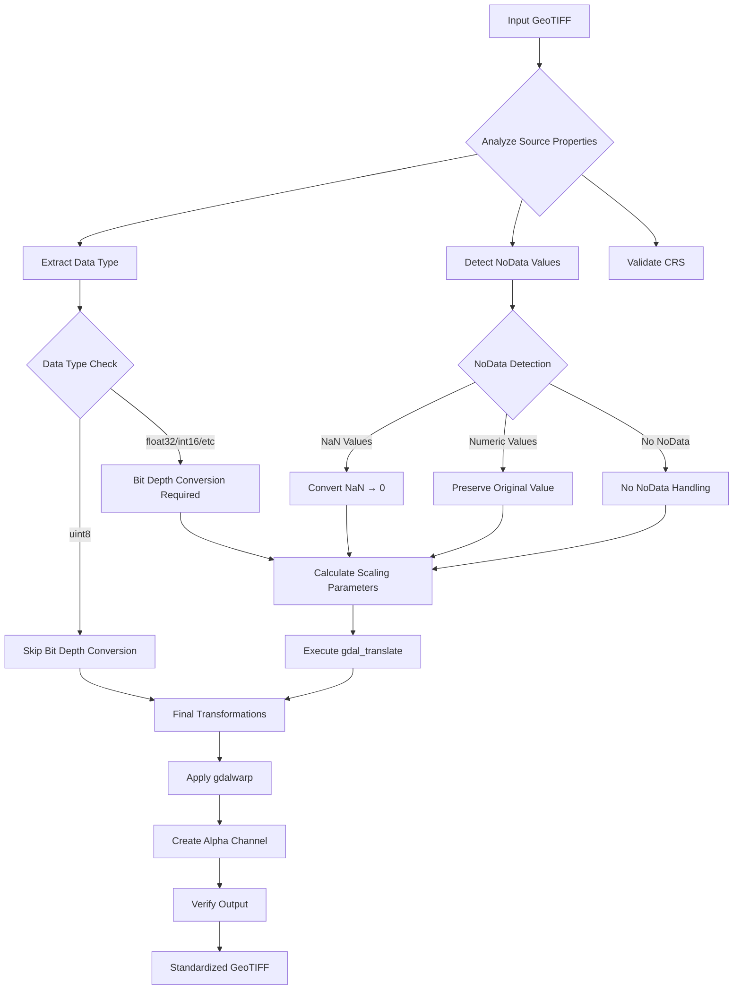
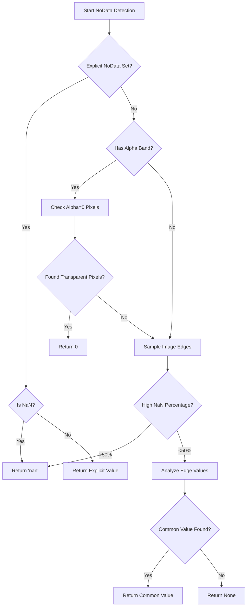
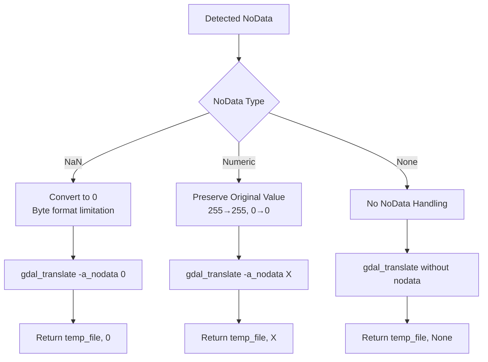
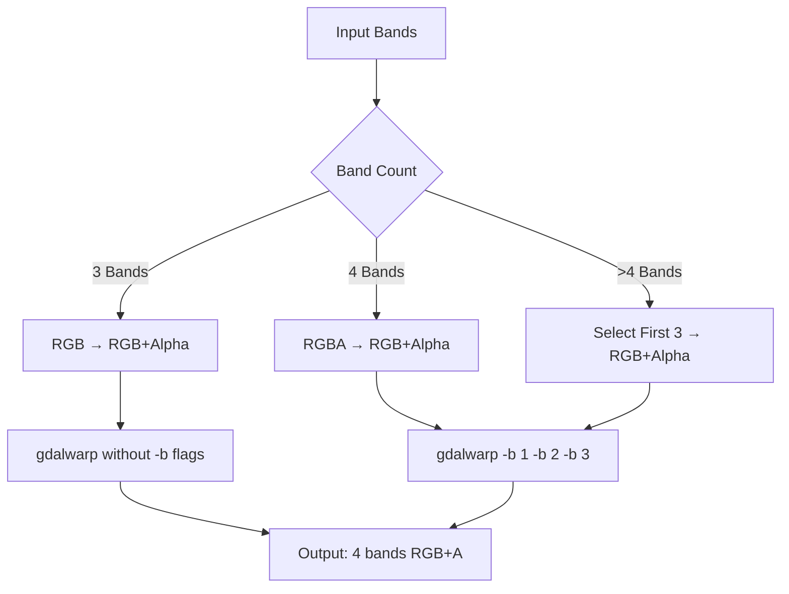
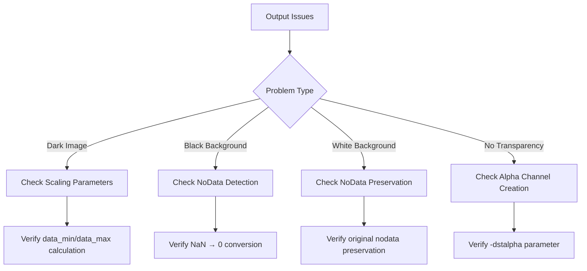
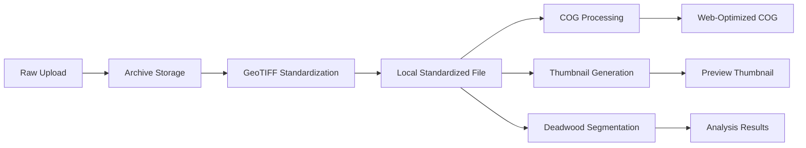

# GeoTIFF Standardization Process Documentation

## Overview

The GeoTIFF standardization process is a critical component of the orthophoto processing pipeline that ensures consistent, web-optimized, and properly formatted geospatial imagery. This process handles various input formats and data quality issues to produce standardized 8-bit RGB+Alpha GeoTIFF files with proper transparency handling.

## Objectives

### Primary Goals
1. **Data Type Standardization**: Convert all input formats to 8-bit unsigned integer (uint8)
2. **Dynamic Range Optimization**: Scale compressed dynamic ranges to full 0-255 brightness
3. **NoData Transparency**: Convert nodata pixels to proper alpha channel transparency
4. **Format Consistency**: Ensure all outputs follow the same structure and compression
5. **Quality Preservation**: Maintain visual quality while optimizing for web delivery

### Technical Requirements
- **Output Format**: GeoTIFF with RGB+Alpha channels
- **Data Type**: 8-bit unsigned integer (uint8)
- **Compression**: DEFLATE with predictor for optimal file size
- **Tiling**: Enabled for efficient streaming
- **Transparency**: Alpha channel for nodata areas
- **CRS Preservation**: Maintain original coordinate reference system

## Process Architecture



## Detailed Process Flow

### Phase 1: Source Analysis

#### 1.1 Property Extraction
```python
def _get_source_properties(input_path: str) -> dict:
    properties = {
        'dtype': src.profile['dtype'],      # Data type (float32, uint8, etc.)
        'num_bands': src.count,             # Number of bands (3=RGB, 4=RGBA)
        'crs': src.crs,                     # Coordinate Reference System
        'nodata': find_nodata_value(src, src.count)  # Detected nodata value
    }
```

#### 1.2 NoData Detection Algorithm
The system employs a sophisticated nodata detection strategy:



**Detection Priority:**
1. **Explicit NoData**: Check `src.nodata` property
2. **NaN Detection**: Identify NaN values in Float32 data
3. **Alpha Channel**: Look for transparent pixels (alpha=0)
4. **Edge Analysis**: Sample image borders for common background values
5. **Statistical Analysis**: Find values representing >30% of edge pixels

### Phase 2: Bit Depth Conversion

#### 2.1 Scaling Parameter Calculation

**Challenge**: Traditional auto-scaling fails when nodata values interfere with min/max calculation.

**Solution**: Intelligent data sampling that excludes nodata values:

```python
# Read sample data excluding nodata for proper scaling
valid_mask = ~np.isnan(sample_data)
if explicit_nodata is not None and not np.isnan(explicit_nodata):
    valid_mask = valid_mask & (sample_data != explicit_nodata)

valid_data = sample_data[valid_mask]
data_min = float(np.min(valid_data))
data_max = float(np.max(valid_data))
```

#### 2.2 NoData Value Preservation Strategy



#### 2.3 GDAL Translate Command Construction

```bash
gdal_translate \
  -ot Byte \                                    # Convert to 8-bit
  -a_nodata [detected_value] \                  # Set nodata value
  -scale [data_min] [data_max] 0 255 \         # Explicit scaling
  input.tif temp.tif
```

**Key Parameters:**
- **`-ot Byte`**: Force 8-bit output
- **`-a_nodata X`**: Set output nodata value (preserves original or converts NaN→0)
- **`-scale min max 0 255`**: Explicit scaling to avoid NaN interference
- **Explicit min/max**: Calculated from valid data only, excluding nodata pixels

### Phase 3: Final Transformations

#### 3.1 Alpha Channel Creation

```bash
gdalwarp \
  -of GTiff \
  -co TILED=YES \
  -co COMPRESS=DEFLATE \
  -co PREDICTOR=2 \
  -srcnodata [final_nodata_value] \            # Use actual nodata from intermediate file
  -dstalpha \                                   # Create alpha channel
  temp.tif output.tif
```

#### 3.2 Band Selection Logic



## Problem Cases and Solutions

### Case 1: NaN NoData Values (Float32 Orthophotos)

**Problem**: 
- 68% of pixels are NaN
- Auto-scaling fails due to NaN interference
- Results in extremely dark images (0-70 range instead of 0-255)

**Solution**:
```python
# Exclude NaN from scaling calculation
valid_mask = ~np.isnan(sample_data)
valid_data = sample_data[valid_mask]
data_min, data_max = np.min(valid_data), np.max(valid_data)

# Convert NaN to 0 for Byte format
translate_cmd.extend(['-a_nodata', '0'])
# Use explicit scaling
translate_cmd.extend(['-scale', str(data_min), str(data_max), '0', '255'])
```

### Case 2: White Background NoData (255 Values)

**Problem**:
- NoData value is 255 (white)
- Standardizing to 0 makes wrong pixels transparent
- Results in white background instead of transparency

**Solution**:
```python
# Preserve original nodata value
if explicit_nodata == 255:
    translate_cmd.extend(['-a_nodata', '255'])
    final_nodata_value = 255

# Use correct srcnodata in gdalwarp
cmd.extend(['-srcnodata', '255', '-dstalpha'])
```

### Case 3: Compressed Dynamic Range

**Problem**:
- Float32 data with values 0-70 instead of 0-255
- Direct conversion results in dark images
- Traditional auto-scaling confused by nodata

**Solution**:
```python
# Calculate scaling from valid data only
valid_data = sample_data[~np.isnan(sample_data)]
if explicit_nodata is not None:
    valid_data = valid_data[valid_data != explicit_nodata]

# Apply explicit scaling
data_min, data_max = np.min(valid_data), np.max(valid_data)
# This maps 0-70 → 0-255 properly
```

## Quality Assurance

### Verification Steps

1. **File Integrity**: Verify output can be opened by rasterio
2. **Data Range**: Confirm values are in 0-255 range
3. **Transparency**: Verify alpha channel exists and functions
4. **CRS Preservation**: Ensure coordinate system is maintained
5. **Visual Inspection**: Check brightness and transparency rendering

### Common Issues and Diagnostics



## Performance Considerations

### Processing Time
- **uint8 files**: ~1-2 seconds (minimal processing)
- **Float32 files**: ~10-30 seconds (full conversion pipeline)
- **Large files (>1GB)**: ~1-5 minutes depending on complexity

### Memory Usage
- **Sample-based analysis**: Uses 1000x1000 pixel samples to minimize memory
- **Streaming processing**: GDAL handles large files efficiently
- **Temporary files**: Intermediate files cleaned up automatically

### Optimization Strategies
- **Early detection**: Skip processing for already-standardized files
- **Parallel processing**: GDAL configured for multi-threading
- **Efficient sampling**: Statistical analysis on small data samples
- **Compression**: DEFLATE with predictor for optimal file sizes

## Integration Points

### Pipeline Position
1. **Input**: Raw orthophoto files from storage server
2. **Processing**: GeoTIFF standardization (this process)
3. **Output**: Standardized files used by COG, thumbnail, and segmentation processes

### File Lifecycle


### Error Handling
- **Graceful degradation**: Continue processing with warnings for minor issues
- **Comprehensive logging**: Detailed logs for debugging and monitoring
- **Cleanup procedures**: Automatic removal of temporary files on success/failure
- **Status updates**: Real-time progress reporting to user interface


This standardization process ensures that all orthophoto data entering the system is properly formatted, optimized, and ready for downstream processing while maintaining the highest possible visual quality and proper transparency handling.
