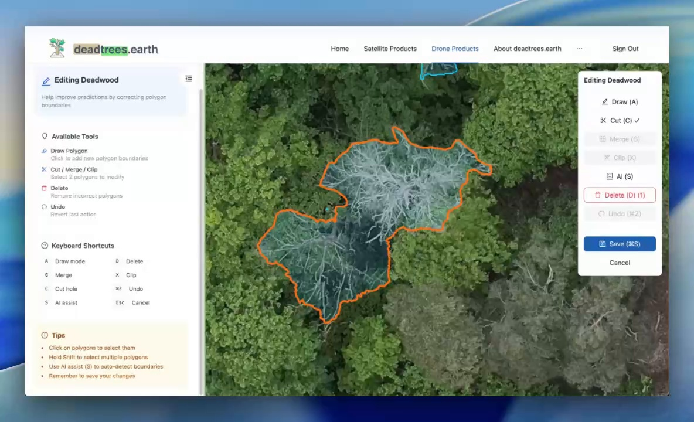
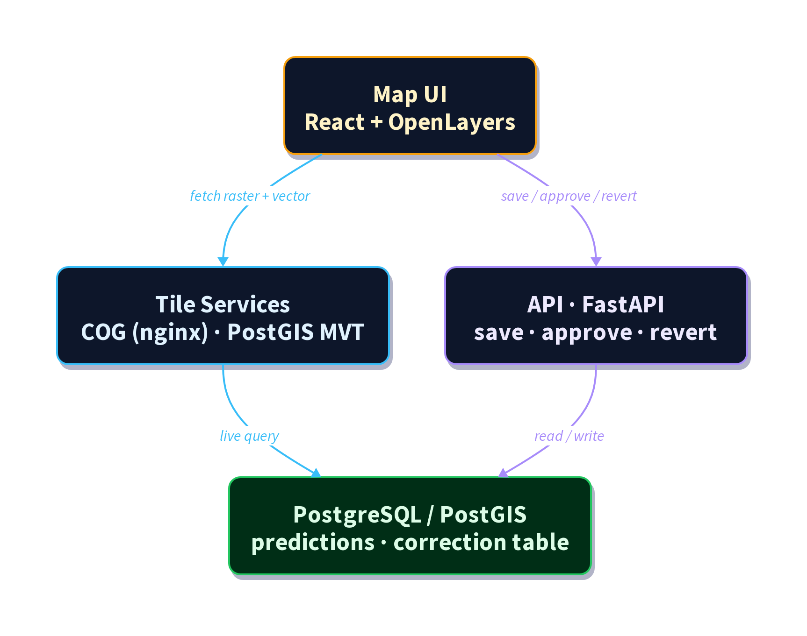

# GeoLabel: Community Label Correction for Geospatial ML

## Overview
GeoLabel is a browser-based correction workflow on [deadtrees.earth](https://deadtrees.earth/) for improving geospatial machine learning predictions in a transparent and auditable way. Contributors edit polygons directly on high-resolution orthomosaics, while auditors review and validate proposed changes through a structured `pending -> approve/revert` process.

*GeoLabel editing interface on deadtrees.earth with polygon tools and context-aware map view.*

## Implemented solution
- In-browser geospatial editing with tools for draw, cut, clip, merge, delete, undo, and optional AI-assisted boundary support.
- Correction-based data model that preserves original predictions and stores all edits with review metadata.
- Role-based contributor/auditor workflow for quality control and reversible decisions.
- Scalable map rendering through PostGIS-native vector tiles.

*Example screencast of AI-assisted boundary support during correction editing.*

## Data and software availability
- Platform: https://deadtrees.earth
- Monorepo repository (MIT): https://github.com/Deadwood-ai/deadtrees
- Frontend application path: `frontend/`
- Roadmap PDF (NFDI template): `docs/projects/geolabel/roadmap-report-nfdi.pdf`
- Roadmap markdown source: `docs/projects/geolabel/roadmap-report-pdf.md`

## Innovation and FAIRness
Compared to conventional annotation workflows, GeoLabel integrates FAIR-oriented handling directly into the correction workflow:
- **Findable/Accessible** through a public platform and open repositories.
- **Interoperable** via PostGIS-based geospatial standards and common spatial formats.
- **Reusable** through explicit correction provenance, review states, and reversible edits.

*High-level architecture of visualization, correction, storage, and review components.*

## Relevance for the community
Current uptake indicators (last 12 months):
- 7,472 datasets submitted
- 166 unique submitters
- 18,155 unique users

The approach is transferable to other Earth System Science domains where large geospatial prediction layers require collaborative review and quality-controlled refinement.

## Challenges and next steps
Main technical challenge: balancing high-performance visualization with direct editing and robust review/audit logic in one operational workflow. Next steps include extending correction workflows to additional label types, improving correction analytics and reviewer throughput, and strengthening long-term integration of corrected labels into model development cycles.

## Contact and funding
Corresponding author: Janusch Vajna-Jehle (janusch.jehle@geosense.uni-freiburg.de)

This work has been funded by the German Research Foundation via NFDI4Earth (DFG project no. 460036893, https://www.nfdi4earth.de/).
