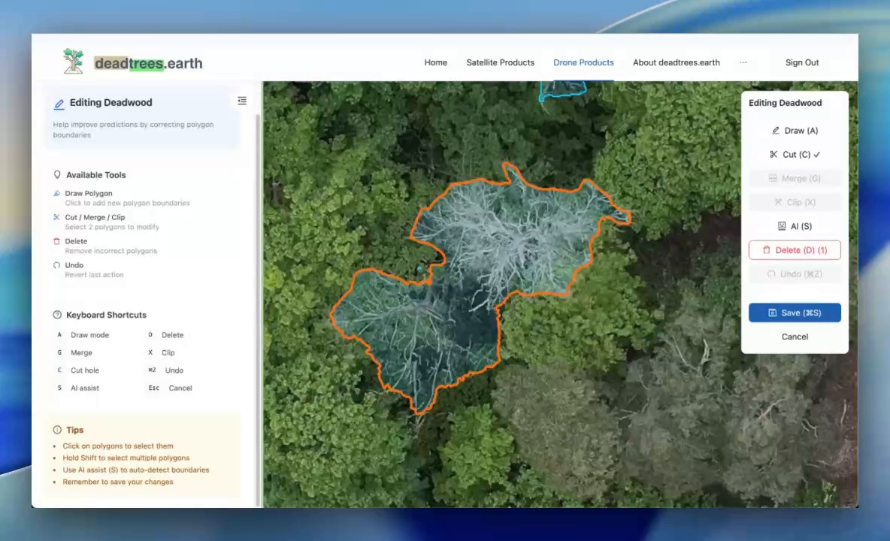
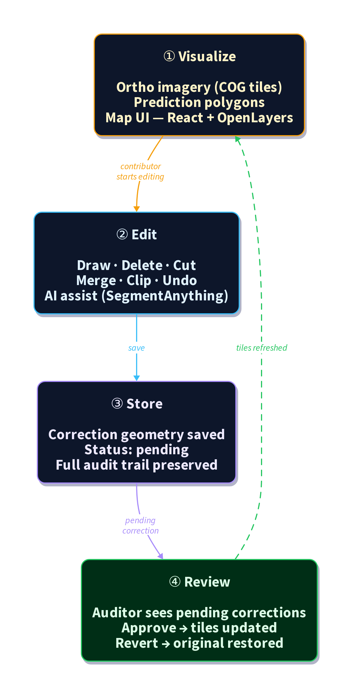
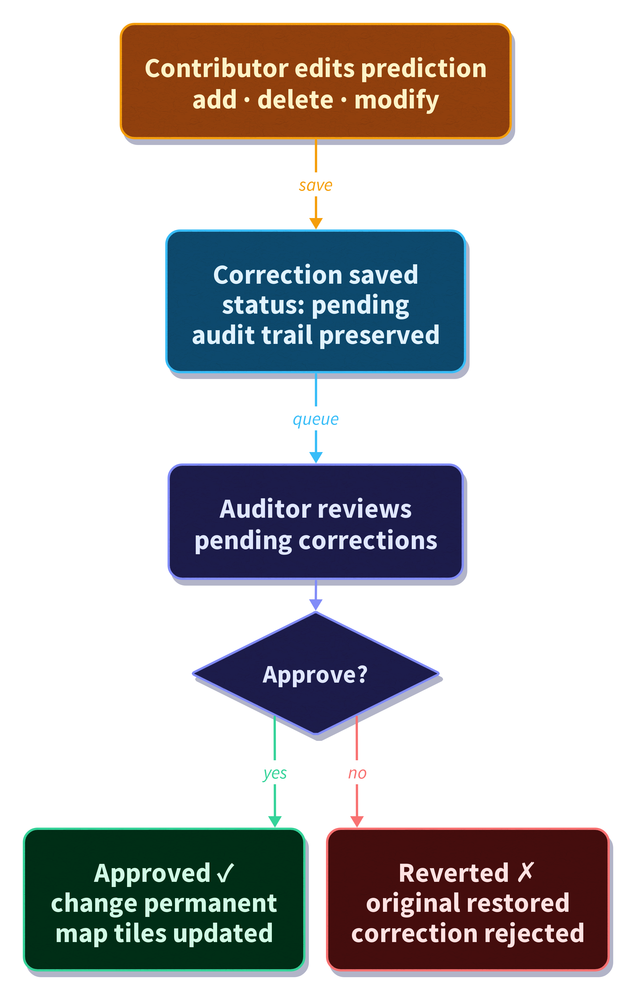

# GeoLabel: Community Label Correction System for Geospatial ML
Teja Kattenborn1, Janusch Vajna-Jehle1, Clemens Mosig2

1 Chair of Sensor-based Geoinformatics (GeoSense), University of Freiburg, Germany
2 Institute for Earth System Science and Remote Sensing, Leipzig University, Germany

Date of submission: TBD

| Pilot title | GeoLabel: Community Label Correction System |
| :---- | :---- |
| Project duration | 01-2025 to 12-2025 |
| Contributors | Teja Kattenborn (Conceptualization; Project Administration; Supervision; Writing - Review & Editing), Janusch Vajna-Jehle (Software; Writing - Original Draft), Clemens Mosig (Conceptualization; Writing - Review & Editing) |
| DOI | To be reserved on Zenodo |
| Corresponding author | TBD |

This work has been funded by the German Research Foundation via NFDI4Earth (DFG project no. 460036893, https://www.nfdi4earth.de/).

## Abstract

High-quality geospatial labels are a central prerequisite for training and validating machine learning models in Earth System Science. However, current labeling workflows face critical bottlenecks: limited support for large geospatial datasets, insufficient integration of geospatial context, lack of scalable web-based collaboration, and missing audit mechanisms for quality control. Existing tools are often not designed for georeferenced data, do not scale to large prediction layers, and provide limited support for distributed community contributions or AI-assisted editing.
GeoLabel addresses these challenges through the development of a scalable, browser-based, and community-driven correction and labeling system for geospatial machine learning outputs. The system enables users to directly review and edit model predictions in a web-based GIS environment, combining interactive polygon editing with optional AI-assisted boundary suggestions. A structured audit workflow ensures that community contributions remain transparent, reversible, and scientifically reliable.
The tool architecture integrates database-native vector tile generation, role-based editing and review workflows, and conflict-aware data handling to enable fast rendering and safe collaborative editing of large datasets. By combining high-performance geospatial visualization with AI-assisted labeling and built-in auditability, GeoLabel provides an operational solution to one of the major bottlenecks in geospatial ML: scalable, high-quality, and community-based label refinement.
The developed tools are showcased on the [deadtrees.earth](https://deadtrees.earth/) platform using high-resolution orthoimages as a real-world application case. In this context, GeoLabel enables the correction and refinement of model predictions for deadwood detection and forest cover mapping. This deployment demonstrates how large-scale orthomosaic-based segmentation outputs can be collaboratively reviewed and improved in a fully web-based environment, providing a transferable template for similar Earth observation workflows across domains.

## I. Introduction

Machine learning (ML) methods have become a cornerstone of Earth System Science (ESS), enabling large-scale mapping, monitoring, and modeling of complex environmental processes from remote sensing data. Applications range from vegetation structure and species mapping to disturbance detection, land cover classification, and ecosystem monitoring across spatial scales. However, the performance, transferability, and interpretability of these models critically depend on the availability of high-quality, geospatially explicit labels.

Despite rapid advances in model architectures and computational infrastructure, the generation and curation of reliable training and validation data remain major bottlenecks. In many ESS domains, labels are sparse, inconsistently formatted, spatially biased, or not preserved with sufficient metadata. Moreover, labeling workflows are often fragmented across tools that were not designed for large, georeferenced datasets. Conventional annotation software typically operates on small, non-geocoded image subsets, limiting spatial context, reducing interoperability, and complicating downstream reuse. As a result, researchers frequently resort to ad hoc workflows that combine GIS software, local scripts, and manual data handling—processes that are time-consuming, difficult to reproduce, and hard to scale.

Several core challenges can be identified:
* **Scalability**: Large orthomosaics, satellite time series, and dense prediction layers exceed the capacity of many conventional labeling tools. Efficient visualization and editing of millions of geometries require database-native and tile-based solutions.
* **Geospatial context**: Labels must remain spatially explicit, interoperable, and compatible with standard geospatial formats to enable reuse across tasks and resolutions. Currently, most labelled dataset are created on tiles with fixed size (e.g. 512x512 pixels) without geocoordinates, making reuse with different settings not possibl.
* **Collaboration**: Distributed community contributions are increasingly important, yet most tools lack robust role management, conflict handling, and web-based accessibility.
* **Auditability and quality control**: Open contribution models require structured review, versioning, and revert mechanisms to ensure scientific reliability.
* **AI-assisted workflows**: While automated segmentation models exist, few systems tightly integrate AI-assisted boundary refinement into interactive, browser-based editing environments. AI-assisted labelling could overcome labelling effort considerably.

GeoLabel addresses these bottlenecks by developing a scalable, web-based, and community-driven correction and labeling system for geospatial ML outputs. Rather than treating labeling as an isolated preprocessing step, GeoLabel integrates prediction review, correction, and audit mechanisms directly into a browser-accessible GIS workflow. The system is designed to handle large prediction layers derived from high-resolution Earth observation data, while preserving full geospatial context and metadata.

Technically, GeoLabel combines efficient brower-based visualization with role-based editing and review workflows. Corrections are stored separately from the original predictions, enabling reversible edits, structured approval processes, and full audit trails. AI-assisted segmentation can be optionally activated to support boundary delineation, improving efficiency without sacrificing transparency.

The pilot demonstrates this workflow in a real-world Earth observation context using high-resolution orthoimages, where deadwood and forest cover predictions are collaboratively reviewed and refined in high resolution drone imagery. By embedding correction tools directly within an operational platform, GeoLabel moves beyond conceptual tool design and provides a functional example of scalable, community-based geospatial label refinement.

## II. Results

### a) Implemented solution
GeoLabel is implemented as a public correction workflow integrated into [deadtrees.earth](https://deadtrees.earth/). Users review model predictions on high-resolution orthomosaics and propose edits directly on the map. The correction workflow is designed around two complementary roles: contributors propose edits through an interactive browser-based editor, while auditors review pending changes, approve or revert them, and maintain a clear audit trail.

<figure>

<figcaption><em>The GeoLabel editing interface on deadtrees.earth, showing the polygon editor with available tools, keyboard shortcuts, and an active correction on a high-resolution orthomosaic.</em></figcaption>
</figure>

#### Editing tools

The editor provides a comprehensive set of polygon editing tools for correcting model predictions. All edits are stored as corrections linked to the original predictions, preserving the source data while tracking every change with full audit metadata.

<table>
<tr>
<td width="25%">

 <em>Freehand draw.</em>
</td>
<td width="25%">

 <em>Click draw.</em>
</td>
<td width="25%">

 <em>AI boundary assist.</em>
</td>
<td width="25%">

 <em>Delete polygon.</em>
</td>
</tr>
<tr>
<td width="25%">

 <em>Cut hole.</em>
</td>
<td width="25%">

 <em>Merge polygons.</em>
</td>
<td width="25%">

 <em>Clip polygons.</em>
</td>
<td width="25%">

 <em>Undo action.</em>
</td>
</tr>
</table>

Keyboard shortcuts support fast, friction-free editing:

| Key | Action | Key | Action |
|-----|--------|-----|--------|
| A | Draw mode | S | Toggle AI assist |
| D | Delete selection | Ctrl/Cmd+Z | Undo |
| G | Merge polygons | Ctrl/Cmd+S | Save |
| X | Clip polygons | Esc | Cancel editing |
| C | Cut hole | | |

#### Architecture

The system architecture combines database-native vector tile generation with a structured correction workflow, enabling fast rendering of large prediction layers and safe collaborative editing.

*GeoLabel correction workflow architecture (visualize → edit → store → review) with correction status feeding back into database-native vector tiles.*

##### Correction lifecycle (conceptual)

The correction lifecycle is designed to make community contributions auditable and reversible. Contributors submit corrections in `pending` status; auditors then approve or revert them as part of a structured review process.

*Conceptual correction lifecycle: corrections are stored with review status and applied in a reversible manner (e.g., inserts and soft-deletes), enabling safe community editing with formal review.*

##### Audit and approval workflow

Auditors review pending corrections in an audit UI and can approve or revert changes to preserve data quality.

<figure>

<figcaption><em>Screencast: approving pending corrections as part of the audit workflow.</em></figcaption>
</figure>

Key architectural decisions:

- **Database-native vector tiles**: Prediction geometries are rendered as vector tiles generated directly in PostGIS using `ST_AsMVT`, avoiding the need for a separate tile server. Tiles include correction status metadata, enabling visual distinction between pending and approved edits.
- **Correction-based editing**: Edits are stored in a dedicated correction table rather than modifying predictions directly. Original geometries are soft-deleted (flagged, not removed), making every change fully reversible.
- **Audit workflow**: Corrections start with `pending` status. Auditors can approve (making changes permanent) or revert (restoring original geometries and removing additions). The full edit history, including contributor, timestamp, and session, is preserved.
- **AI-assisted segmentation**: Users can optionally activate SegmentAnything to propose polygon boundaries. The ortho raster is cropped client-side, sent to an external SAM API, and returned polygons are added to the editor as regular edits.
- **Multi-layer support**: The same correction workflow applies to both deadwood and forest cover prediction layers, with layer-specific vector tile endpoints and shared correction infrastructure.

### b) Data and software availability
- Platform: https://deadtrees.earth
- Backend repository (public, GPL-3.0): https://github.com/Deadwood-ai/deadtrees
- Frontend repository: https://github.com/Deadwood-ai/deadtrees-frontend-react (planned for public release)
- Pilot documentation: `docs/projects/geolabel/`

The platform provides open access to datasets, prediction layers, and the GeoLabel correction workflows. Documentation includes user guidance, technical overviews, and detailed descriptions of the correction workflow.

Core data and software assets include:

- PostGIS-backed vector tile generation for large-scale prediction layers.
- Correction history stored in a dedicated table with review metadata and session tracking.
- Supabase RPC functions that expose database logic as API endpoints for save, approve, and revert operations.

### c) Innovation and FAIRness
The key innovation is a community-first, audit-ready correction system applied directly to model outputs, rather than isolated labeling tasks. This approach supports:

- Findability and accessibility: open access to datasets and corrections via a public platform.
- Interoperability: PostGIS-based geospatial standards and APIs; use of common geospatial data formats for labelled data (geopackage and GeoTIFF format).
- Reusability: corrections are tracked, reviewed, and preserved with history, supporting downstream model training and validation.

GeoLabel also demonstrates a scalable approach to collaborative labeling that can be adapted to other domains in Earth System Science. Its modular architecture allows the integration of different data types, prediction layers, and labeling tasks without fundamental changes to the core system. By combining database-native geospatial processing, browser-based editing, and structured audit workflows, the approach can be transferred to applications such as land cover mapping, habitat delineation, cryosphere monitoring, or coastal change detection. This flexibility makes GeoLabel not only a domain-specific solution, but a generalizable framework for community-driven, AI-assisted geospatial data curation

## III. Challenges and gaps
The main technical challenge was balancing high-performance visualization with direct, editable data access. Several iterations were required:

1) Copy-based editing (used in the reference data editor). This approach is reliable but slow for large datasets and leads to heavy data duplication.
2) Database-native vector tiles and edit workflows. The final solution generates vector tiles directly in the database and exposes PostGIS functions as API endpoints. This allows fast rendering and direct editing without full dataset copies.

Additional challenges included:

- Designing a robust audit workflow for community contributions.
- Ensuring edits remain reversible and auditable to preserve data quality.
- Optimizing caching and tile refresh to avoid stale visuals after edits.

The final system resolves these issues by combining PostGIS MVT generation with Supabase RPC functions for save/approve/revert workflows and a review queue for auditors.

## IV. Relevance for the community and NFDI4Earth

The GeoLabel team has been highly active in presenting and discussing the pilot at international conferences, workshops, and community meetings, with a strong focus on research data management (RDM), FAIR principles, and scalable geospatial infrastructures. The underlying concepts, system architecture, and demonstrator use case were continuously communicated to both the Earth System Science and NFDI communities, fostering dialogue on collaborative labeling and AI-ready data workflows. In addition, the conceptual and methodological foundations and application context have been formalized in peer-reviewed publications, strengthening the scientific visibility and long-term impact of the initiative.

Community uptake indicators (last 12 months):

- 7,472 datasets submitted
- 166 unique submitters
- 18,155 unique users (based on distinct pageview users)

Outreach and visibility include:

- Joint NFDI4Earth & NFDI4Biodiversity Plenary 2025 (Bremen) on the GeoLabel pilot
- SmartForest 2025: deadtrees.earth: Crowd-Sourced Imagery and AI for Global Insights into Tree Mortality Dynamics
- Dreilaendertagung 2025: From Local Drones to Global Insights: AI-Driven Tree Mortality Mapping with Remote Sensing
- EGU 2025 & EGU 2026 talks on the deadtrees.earth platform and related RDM activities
- Living Planet Symposium 2025 and BioSpace 2025 presentations
- International Tree Mortality Network seminar (2024)

Publications:
- Mosig, C., Vajna-Jehle, J., Mahecha, M. D., Cheng, Y., Hartmann, H., Montero, D., Junttila, S., Horion, S., Schwenke, M. B., ... & Kattenborn, T. (2026). *deadtrees.earth – An open-access and interactive database for centimeter-scale aerial imagery to uncover global tree mortality dynamics*. Remote Sensing of Environment, 332, 115027. https://doi.org/10.1016/j.rse.2025.115027
- Möhring, J., Kattenborn, T., Mahecha, M. D., Cheng, Y., Beloiu Schwenke, M., Cloutier, M., Denter, M., Frey, J., Gassilloud, M., Göritz, A., Hempel, J., Horion, S., Jucker, T., Junttila, S., Khatri-Chhetri, P., Korznikov, K., Kruse, S., Laliberté, E., Maroschek, M., Neumeier, P., Pérez-Priego, O., Potts, A., Schiefer, F., Seidl, R., Vajna-Jehle, J., Zielewska-Büttner, K., & Mosig, C. (2025). Global, multi-scale standing deadwood segmentation in centimeter-scale aerial images. ISPRS Open Journal of Photogrammetry and Remote Sensing. https://doi.org/10.1016/j.ophoto.2025.100104

These activities demonstrate active engagement with the Earth System Science community and provide multiple entry points for collaboration and adoption.

## V. Future directions
GeoLabel establishes a robust public correction workflow, but there is still substantial opportunity for growth. The pilot shows that community labeling at scale is feasible when performance, auditability, and usability are addressed together. The next steps focus on strengthening adoption, expanding feature coverage, and ensuring long-term sustainability:

- Expand correction workflows to additional label types and domains.
- Improve analytical tooling around correction impact and reviewer throughput.
- Provide enriched dataset metadata and tighter linkage to publications.
- Support broader integration into external workflows and third-party systems.
- Continue outreach to grow the contributor base and diversify geographic coverage.
- Integrate crowd-sourced labels into active supervised AI training workflows.

## Publications and related outputs (selected)
- Mosig, C., Vajna-Jehle, J., Mahecha, M. D., Cheng, Y., Hartmann, H., Montero, D., Junttila, S., Horion, S., Schwenke, M. B., ... & Kattenborn, T. (2026). *deadtrees.earth – An open-access and interactive database for centimeter-scale aerial imagery to uncover global tree mortality dynamics*. Remote Sensing of Environment, 332, 115027. https://doi.org/10.1016/j.rse.2025.115027
- Möhring, J., Kattenborn, T., Mahecha, M. D., Cheng, Y., Beloiu Schwenke, M., Cloutier, M., Denter, M., Frey, J., Gassilloud, M., Göritz, A., Hempel, J., Horion, S., Jucker, T., Junttila, S., Khatri-Chhetri, P., Korznikov, K., Kruse, S., Laliberté, E., Maroschek, M., Neumeier, P., Pérez-Priego, O., Potts, A., Schiefer, F., Seidl, R., Vajna-Jehle, J., Zielewska-Büttner, K., & Mosig, C. (2025). Global, multi-scale standing deadwood segmentation in centimeter-scale aerial images. ISPRS Open Journal of Photogrammetry and Remote Sensing. https://doi.org/10.1016/j.ophoto.2025.100104

## Figures and screenshots
Figures, screencasts, and diagrams are embedded inline throughout Section II.a:
- UI overview screenshot of the GeoLabel editing interface
- Screencasts of editing tools: freehand drawing, click-based drawing, AI-assisted segmentation, deletion, cutting, merging, clipping, and undo
- Screencast: approving pending corrections in the audit UI
- System architecture diagram (D2) showing the high-level workflow (visualize → edit → store → review)
- Correction lifecycle diagram (D2) showing pending → approve / revert and reversible application of edits
