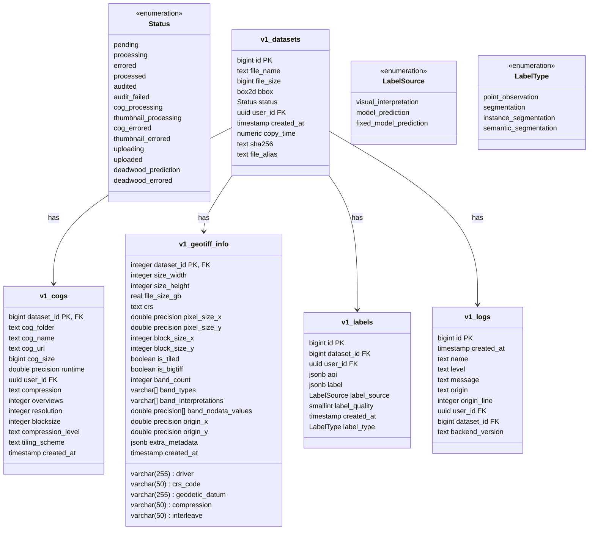
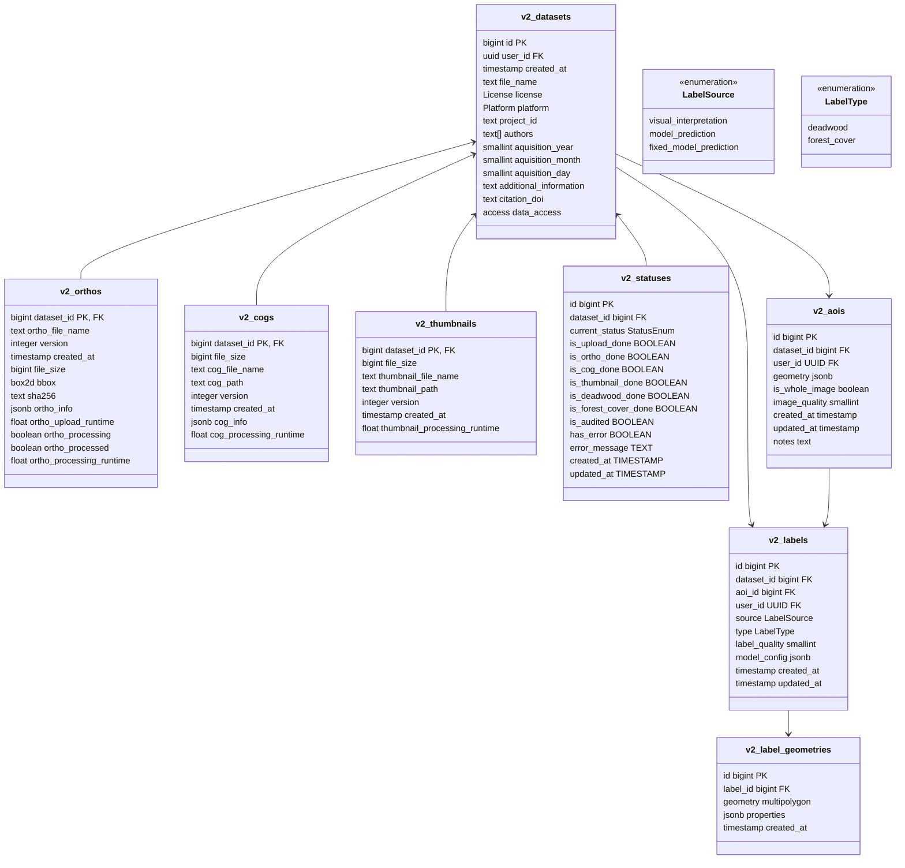
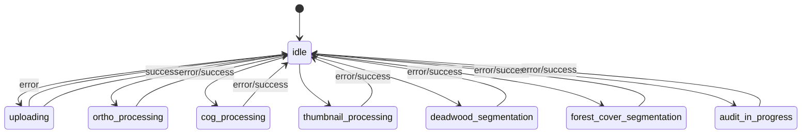

# Schema Changes v1 to v2

The current database schema (v1) is spread across multiple tables with complex relationships and some redundancy:

## Current schema

1. **Multiple Processing Tables (tables which are updated infrequently)**

   - `v1_datasets`: Core table with basic file info, is updated on every status change. Also since i use
   - `v1_metadata`: Separate metadata table
   - `v1_geotiff_info`: Technical metadata
   - `v1_cogs`, `v1_thumbnails`: Processing results
   - `v1_labels`: Label data

2. **Development Tables**

   - Duplicate tables with `dev_` prefix
   - Separate schemas for development and production
   - Increases maintenance overhead

3. **Status Tracking**
   - Status tracking spread across multiple tables
   - Complex state management
   - No clear processing history

## Proposed Table Schemas

1. **Static Dataset Information (v2_datasets)**

   - Datasets table contains only user input
   - No dynamic updates after creation
   - Serves as the central reference point
   - Is running on the storage server and initiated by the frontend

2. **Simplified Processing Tables (v2_orthos, v2_cogs, v2_thumbnails)**

   - Removed redundant columns
   - Consolidated metadata into JSON/JSONB fields (cog_info)
   - Clearer separation of concerns

3. **Improved Status Tracking (v2_statuses)**

   - Boolean flags for completion states
   - Simplified current status enum
   - Better error handling

4. **Removed separate metadata table**

   - Technical metadata moved to respective processing tables
   - User metadata stays in datasets table

5. **Remove dev tables**

   - Locally, I use the production schema for testing and development, without any data. So no need for dev tables anymore.

6. **Adding versioning for processes**

   - each process (ortho_conversion, cog_conversion, thumbnail_conversion, deadwood_segmentation, forest_cover_segmentation) will have a version number, which i will place in the repo together with a changelog. So if i update the process i will increment the version number and exapolin the changes in the changelog, i can easily see what has changed and what has been updated.

7. **Adding a changelog (as a markdown file in the repo)**

   - i will add a changelog to the repo, which will contain all the changes to the code, including schema changes.

## Key Changes

## Status States

## How to structure the schema for the labels?

Some considernation from my side:

- for each label there needs to be a aoi. But what if there is none, e.g uploded data.
- I will implement a new performant vector visualisation approach which for each label stores the vectors as geometry as postgis geometry. One polygon as one row in the table. I will create a new schema for label geometrys, i will use to genereate vector tiles dynamically. So I will store the geomtry in a nother table not v2_labels.

class v2_status {
<<enumeration>>
idle
uploading
ortho_processing
cog_processing
thumbnail_processing
deadwood_segmentation
forest_cover_segmentation
audit_in_progress
}
